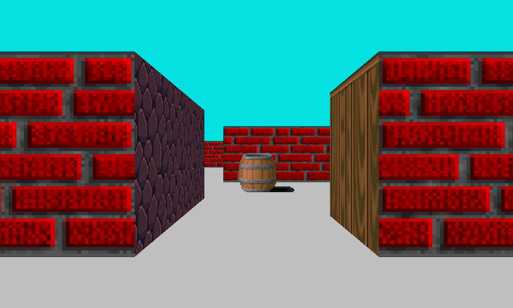
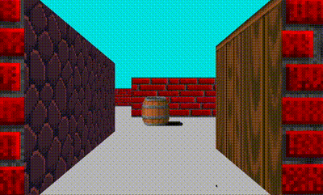

# Cub3D
  School project at 42.
## Purpose
Extract from the Project Subject :

> " This project is inspired by the world-famous Wolfenstein 3D game, which was the first FPS ever. It will enable you to explore ray-casting. Your goal will be to make a dynamic view inside a maze, in which you’ll have to find your way. "

This project is written in C and uses the minilibX, a graphic library derivated from OpenGL. This game is designed to run on MacOS.
## Grade
 **101 / 100**
 
 

  ## Usage
  Execute (on MacOS):    `make all && ./Cub3D map.cub` 
  You can edit `map.cub` to change :
  - the `size` of the `window`
  - the `sky` and `floor` `color`
  - the `north`, `east`, `west`, `south` and `sprite` `textures`
  - the `map`

  ## Controls
``W`` - move forward  
``S`` - move backward  
``A`` - move left  
``D`` - move right  
``↑`` - rotate up  
``↓`` - rotate down  
``←`` - rotate left  
``→`` - rotate right  
``ESC`` - Exit  

## Screenshots

