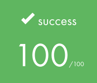
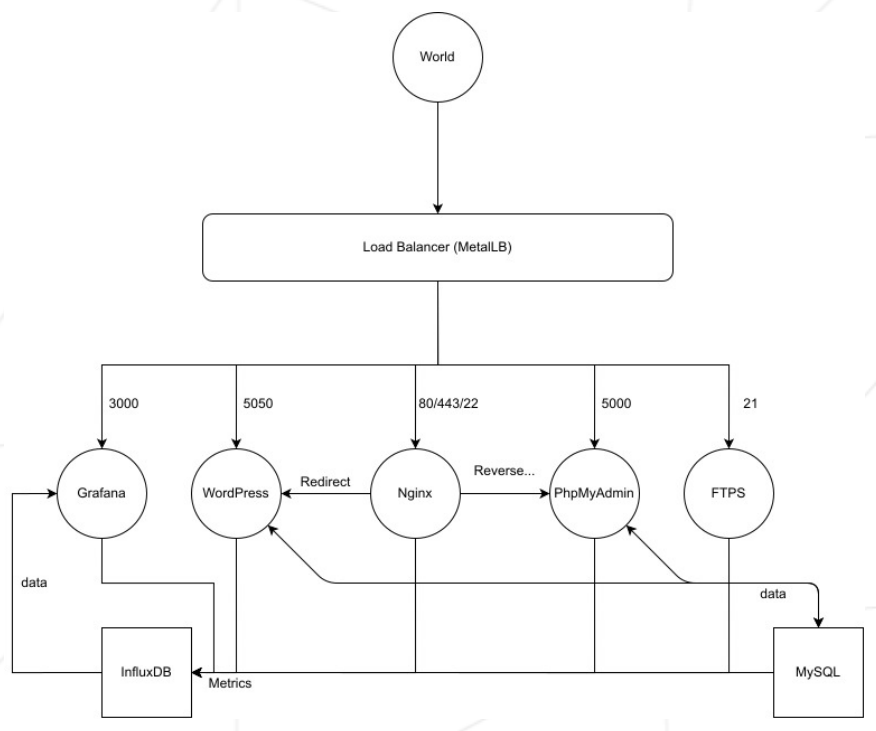

# ft_services

     

## Purpose
This project aims to introduce us to Kubernetes in order to virtualize a network and discover what a production environment is. For this, the project consists in setting up a cluster gathering several service containers. Each service runs in a dedicated container built under Linux Alpine.

## Grade
**100 / 100**
 
 

## Subject
Set up a multi-service cluster using Kubernetes' minikube tool
- A Kubernetes web dashboard
- A Load Balancer which manages the external access of the services
- A WordPress website listening on port 5050, which work with a MySQL database
- A phpMyAdmin, listening on port 5000 and linked with the MySQL database
- A container with a nginx server listening on ports 80 and 443
- A FTPS server listening on port 21
- A Grafana platform, listening on port 3000, linked with an InfluxDB database monitoring all the containers

## Usage

Execute `./setup.sh`